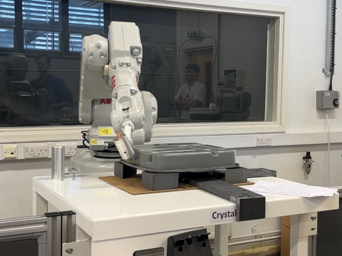

# ABB-Robots-Group-Object
Program an industrial robot (either the IRB1660 or IRB140) to guide a simulated glue dispenser around the edge of an injection molded part. 
The "images" folder shows the running results and the designed jig. 

All the code used to control the movement of the robot arm can be found in `MainMoudle.mod`, which contains specific robot control instructions and necessary code comments. `Crystal_Mech_9.pgf` is an XML file that references the `MainModule.mod` file. The `new_jig_crystal_mech.prt.2` file shows the jig model modeled using Creo CAD software. `jig_specification_file.pdf` explains the design and use of jig.

## Task
Aim: To use the industrial robot to simulate the application of sealant to a complex object (‘the workpiece’), so as to apply the 'sealant' correctly in the minimum time.

The total program cycle should include the following:
1. Conveyor Wait Time
2. Start from Home
3. Pick Tool (or simulate pick up tool)
4. Navigate workpiece (application of the 'sealant')
5. Place Tool (or simulate place tool)
6. Display appropriate messages
7. Return to Home

## Run
Attach the model to the jig.

Use the TCP(Tool Centre Point) `toolCry` and the Workobject `wobjCry`

The Program name is `Crystal Mech`

Then Click `Debug` -> `PP to main` -> `Run`

## Final Result Video

[Click here to watch the final result video](<https://youtu.be/6i8HzuhqgAE>)

